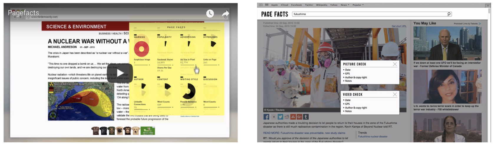
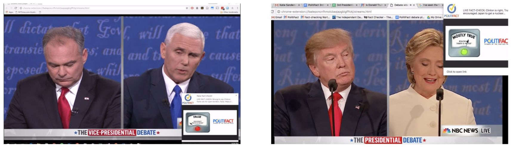
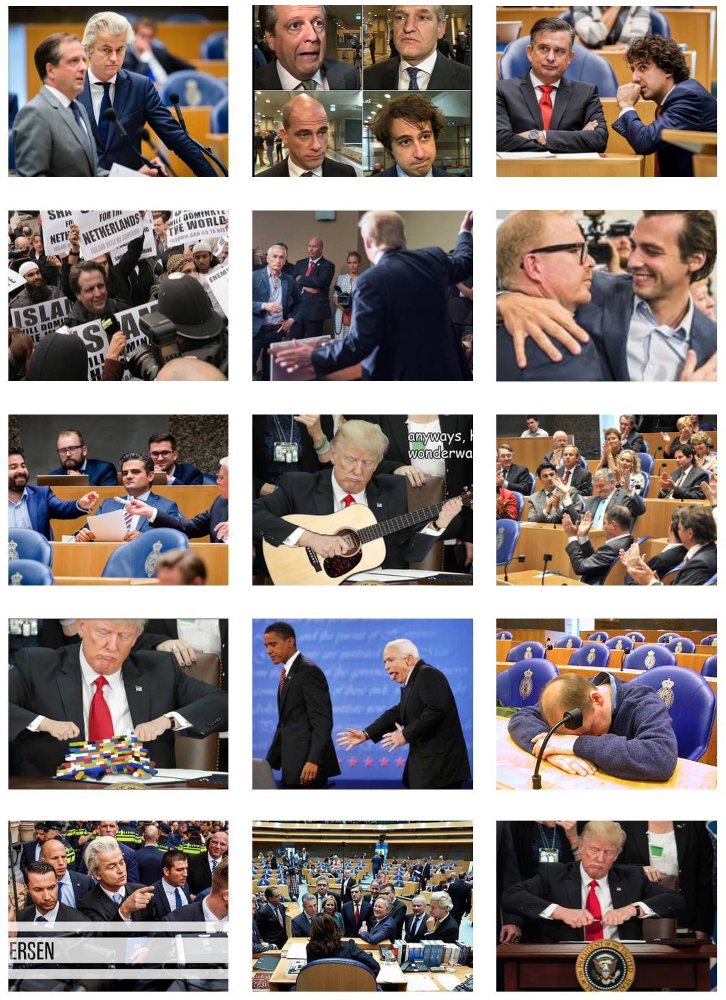
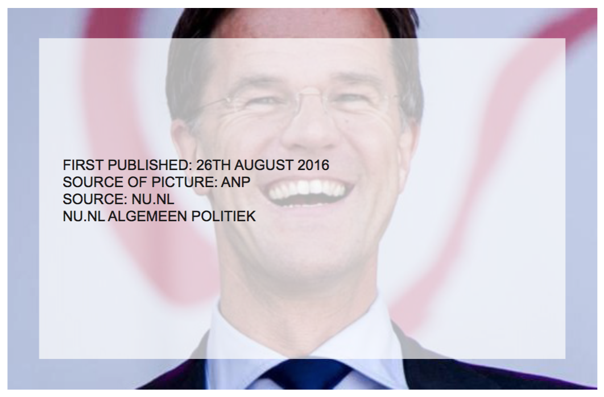
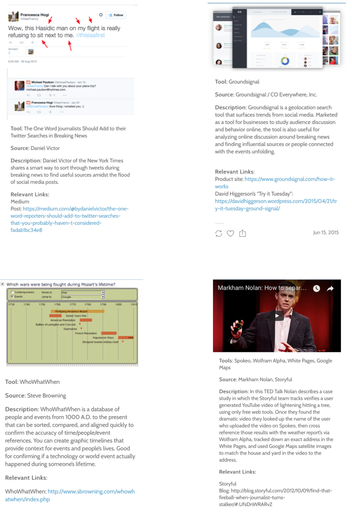

FACTCHECKING TOOLS: WHAT HAS ALREADY BEEN DONE?

• Page Facts

Page Facts came up with the idea of a software that enables journalists to quickly estimate on the credibility of online sources. The software will provide relevant background information on an article in a clear sche- me. Page Facts aspires to generate transparency and clarity on the internet and to help with finding factual information.

• http://www.factcheck.org

We are a nonpartisan, nonprofit “consumer advocate” for voters that aims to reduce the level of deception and confusion in U.S. politics. We monitor the factual accuracy of what is said by major U.S. political play- ers in the form of TV ads, debates, speeches, interviews and news releases. Our goal is to apply the best practices of both journalism and scholarship, and to increase public knowledge and understanding.

• Hoaxy

A new tool called Hoaxy lets you search for terms and articles, and shows you how claims spread on Twit- ter as well as efforts to fact-check them > https://hoaxy.iuni.iu.edu

• FactPopUp

• TedTalk: https://www.youtube.com/watch?v=sNV4yIyXXX0
Markham Nolan: How to separate fact and fiction online

FACTCHECK VISUAL EXAMPLES (POLITICS)


FACT-CHECKING TOOLS AND THEIR ROLE IN A POST-TRUTH WORLD

The phenomenon of fake news is nothing new. As Organisation for Security and Co-operation in Europe’s Representative on Freedom of the Media, Dunja Mijatović, has put it, “people lie and they always have”. But it seems that, especially after the Brexit referendum and the presidential election in the United States, the topic of fake news in social media and its impact is higher on the agenda of journalists and politicians than before. Some even see fake news as a threat to the fundamental democratic order. The structure of social media with its like-and-share mechanisms, and the need to individuate through publishing exclusive material, makes a good breeding ground and distribution sector for false information or for the misinforma- tion of masses. Moreover, as every post on social media comes in the same layout, it makes it more challenging to distinguish between professional journalistic products and populistic clickbait.

Important questions in this regard are not only what exactly counts as fake news but also to what extent should internet giants like Facebook or Google take action? How far can automated fact-checking software tools be helpful for journalists and the general public? And how should those applications be designed?
After a lot of criticism, it seems that Facebook is making a first step announcing, in mid-December, a new option for its users to report allegedly fake news to the social media company. After being run through pre-filtering algorithms, the reported links are passed on to a conglomerate of US journalistic
 fact-checkers debunking actual fake news with published articles. However, since these were only tests, as Adam Mosse- ri, Facebook’s vice-president of product management for News Feed, writes in a blog post the changes are confined to a small percentage of US-based English language users only.

Looking further into the matter of existing tools and extensions to flag or fact-check potential fake news onli- ne, it seems beneficial to be an English-language user interested in news from English speaking countries, since many tools are language and region specific. Neither the recent moves by Facebook nor the latest popular Chrome extensions to flag false information (among them BS Detector, FiB or Slate Magazine’s This Is Fake) are of direct use to non-English speaking Europeans. On the positive side, however, several initiatives offer their extensions as open source material, meaning the code can be used by anyone to im- prove or adopt it to a different language.

Using what is available

One European initiative that took this opportunity and reprogrammed the existing extension – BS Detec- tor, is “Viralgranskaren” from Sweden. Like the original, the extension warns people on Facebook if a post from a problematic Swedish source appears on their timeline or if they access a webpage that deliberately spreads fake news. The extension bases the warnings on a list created by the Swedish fact-checkers. “We have decided to include in the list only those, who intentionally publish false information. That excludes for example pages that deal with conspiracy theories. These are not intentionally false stories, since the people posting the articles there seem to believe in what they are publishing,” says editor Åsa Larrson.
Viralgranskaren can be translated to Viral Examiner and was originally founded as a project within the Swedish Metro daily newspaper in 2014. Now it is a permanent section and fact-checking format that runs a webpage on which the editors publish fact-checked stories and rumours that previously appeared online. In addition to the webpage, Larsson says they are trying to raise general awareness in Sweden to be more source-critical. A short video, created in cooperation with the Internet Foundation in Sweden explaining
the importance of fact-checking, recently got broad attention both inside of Sweden and abroad. “We also provide material for school lessons and are planning a special Be-Source-Critical-Day in March 2017”, says Larsson.

This educational approach seems especially fruitful in the light of a report published in November 2016. The study conducted by a group of Stanford University researchers suggests that up to 80 per cent of pupils and students are not able to distinguish between an advertisement and a news article online. Simi- larly, they struggled with claims on social media. Less than a third of the study’s participants were able to explain how the political agenda of a social media user could influence the content of a tweet or post. Even though the study includes young people in the United States only, it gives an interesting insight into a gene- ration that is considered to be digital natives.

Projects from Eastern Europe

In Central and Eastern European countries, platforms that fact-check statements of politicians and partici- pants in the public debate are prevalent. “Demagog” started for that purpose in Slovakia, due to its success exists now also in the Czech Republic and Poland. “Faktograf” has the same aim in Croatia and “GRASS Fact Check” is active in Georgia. The project “Proverka na Fakti” provides a broader fact-checking overview of the media in Macedonia. The Ukrainian “Stop Fake” investigates how propaganda influences Ukraine and other countries and regions, according to their own accounts. Nevertheless, all the initiatives depend on human fact-checkers and have not yet launched any automated tools or applications.

“Funky Citizens” from Romania has just made an attempt in this direction. The NGO was established in 2012 to engage taxpayers in decision-making processes and to make data on public budget more accessi- ble. By now they also run the fact-checking webpage called “Factual”and have launched a Chrome exten- sion of the same name. However, as explained by Cosmin Pojoranu, project coordinator in charge of the communications department at Funky Citizens, the extension is not meant to flag fake news but highlights fact-checked statements on pages browsed by the user. He or she, therefore, does not need to go to a fact checking page but gets information on fact-checked statements without changing their media habits. The tool is designed to work in Romanian only, but since the extension is open source it can be adopted to different languages and regions.

Tools for Professionals

On a broader pan-European background, the “REVEAL” project funded within the European Union’sSe- venth Framework Programmeaims to develop tools to automate simple verification steps for social media. Their target group are journalists and fact-checking professionals. According to their own accounts they are working on natural language processing as well as image and social network analysis. Since its conception in 2013 they have, for example, created tools to verify the origin of a tweet. Most tools are freely accessible and open source.

By publishing the white paper “The State of Automated Fact-checking” the UK-based platform “Full Fact” tries to position themselves among the pioneers of automated fact-checking, not only in Europe but global- ly. Having just received major funding from Google’s Digital News Initiative, which supports online journa- lism in Europe (among them also a few fact-checking initiatives), they promise to deliver two automated fact-checking software tools by the end of 2017. Full Fact also stresses the need to think and work globally in the field of fact-checking, as, according to them, so far resources are being wasted in fragmented pro- jects reinventing the wheel.

Indeed, this seems to be of key importance in the further development of fact-checking software or applica- tions: the standardisation of data and designs that are adaptable to different languages and regions. Howe- ver, as explained by Krzysztof Madejski, project coordinator at ePanstwo Foundation, which maintains an open database of public data in Poland, “The adaption to another language or country is connected with costs and the tool will always need a reference knowledge base”. Furthermore, improved natural language processing is needed to monitor speech recognition, for example during a TV debate among poli- ticians. Otherwise real-time fact-checking during TV or radio discussions will remain impossible. Moreover, Aleksandra Kuczerawy, a legal researcher and a PhD candidate at KU Leuven, Belgium, recently discussed in a blog post that fact-checking tools can also reflect the biases of their creators, therefore transparency and accountability issues are inevitable. “It is furthermore important to note that content verification tools should not work as censorship tools but rather opt-in mechanisms to remind people that not everything they read online is true,” Kuczerawy explains in the blog post.

Will automated fact-checking tools ultimately do the job by themselves? Certainly not. Åsa Larsson is con- vinced that for the foreseeable future technological tools to detect and fight fake news can only be one ele- ment in fact-checking routines. “Reality is complex. We will need journalistic-skilled people to work with and continuously improve those tools and databases.” Furthermore, according to Cosmin Pojoranu, no compu- ter can read between the lines as well as humans can. Therefore, the work of trustworthy journalists and fact-checkers operating transparently is still of key importance even in times of automated fact-checking.


FACT-CHECKING

NEW TOOL WILL FACT-CHECK DONALD TRUMP’S TWEETS IN REAL TIME David Z. Morris
Dec 18, 2016

On Friday, the Washington Post introduced a Chrome plugin that will automatically display commentary next to Donald Trump’s tweets. Spearheaded by the Post’s politics team at The Fix, the plugin provides context and fact-checking of, for example, Trump’s claims that millions of people voted illegally in the No- vember election.

The Post has retroactively fact-checked Trump’s recent tweets, and they say they’ll continue adding com- mentary to new tweets in something close to real time.

Get Data Sheet, Fortune’s technology newsletter.
It’s no surprise that the Post would roll out a tool that aims to undermine Trump’s statements. The paper is owned by Jeff Bezos, who famously sparred with Trump on Twitter. During his campaign, Trump blacklisted Post reporters from campaign events for a time. The Post Editorial Board in September referred to Trump’s business practices as “sleazy.”

Of course, while it might be convenient for those critical of Trump, the plugin is inherently an exercise in preaching to the choir—it’s unlikely that anyone supportive of Trump is going to go to the trouble of instal- ling a Chrome plugin that promises to undermine him.
The Post team seems to understand their constituency, in some cases providing commentary that pushes the boundary between fact-checking and partisan apologetics:

We’re now in a political climate where even studiously objective fact-checkers like Snopes and Politifact get branded as “far-left” when they comment on dubious right-wing news. If the Post truly wants to encourage more measured dialogue—rather than just flattering those who have done things that are “in no way ille- gal”—they may want to reassess their approach.

VERIFICATIONJUNKIE.COM >>> WHAT TOOLS ARE USED TO CHECK DIFFERENT ITEMS?



/
